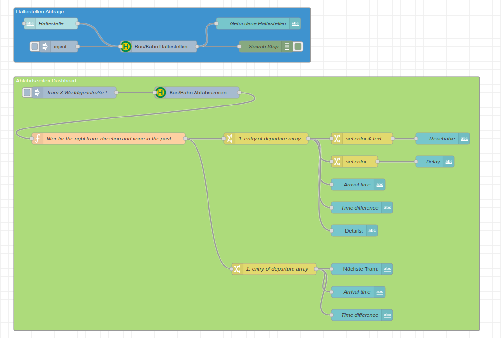
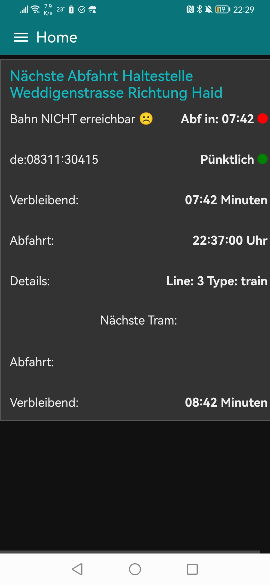

# TRIAS -  Access live public transportation data
>  Uses [trias-client](https://github.com/andaryjo/trias-client) to
> retrieve Data from a Trias API endpoint.
> *API **Endpoint** and API-**KEY** required! (see below)*  

* Fulltext search for `Station ID`  `s   

* Retrieve live data for station using it's unique `Station ID`  (e.g. departure times for Bus / Tram)

## Reference:

* [TRIAS API Endpoints & where to ask for API KEY](https://github.com/public-transport/ideas/issues/18)
* https://github.com/andaryjo/trias-client/blob/main/docs/README.md

## Examples

* Will I catch my tram dashboard (import => [examples](./examples/dashboard.json))

* Alexa, will I catch my tram flow?  (import => [examples](./examples/alexaWannKommtDieTram.json))

## Screenshots:   

